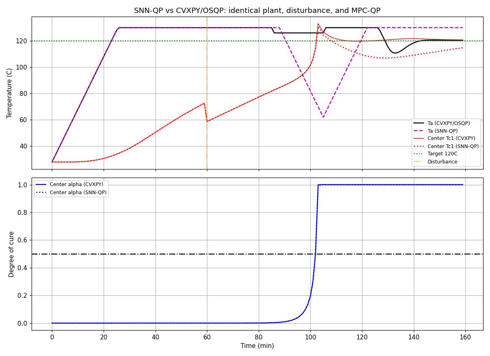
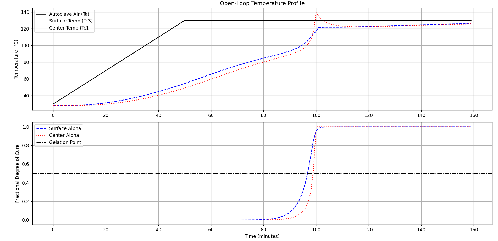
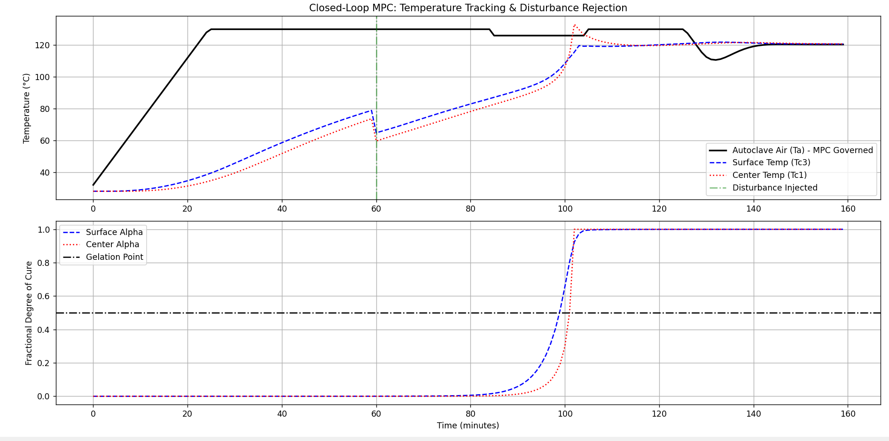
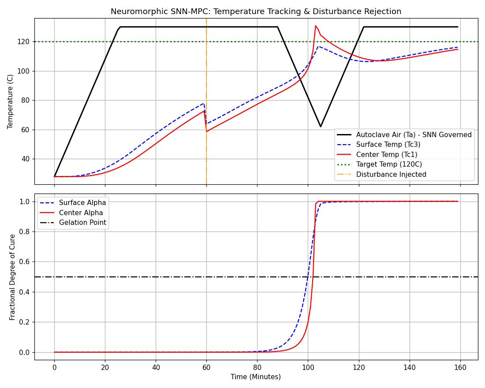

# Adaptive Process Control for Autoclave Composite Curing


## Overview
This repository contains the simulation environment and control architecture for optimizing the autoclave curing process of thick-sectioned composite laminates. The project replaces unmanaged open-loop curing cycles with real-time closed-loop Model Predictive Control (MPC), and asks whether an event-driven Spiking Neural Network (SNN) solver can close the *same* MPC loop.

> **Current status of that question.** The two controllers provably receive the **same per-step QP** (bit-identical arrays from one shared builder, identical prediction model). On the closed loop their applied controls agree to **0.707 °C RMS**, every step is now feasible, and the SNN's formal convergence criterion is met on **51.3 %** of nominal steps — but only **22.6 %** inside the stiff exotherm window, and **0 %** at N=20, where the certificate fails by 113×. About **3.8 %** of applied moves (12.9 % in the stiff window) still come from a downstream safety clip. The honest verdict is **"same QP; feasible everywhere, converges on a substantial fraction of steps, but not reliably and not at the long horizon"** — *not* equivalence. The full write-up is **[`docs/SNN_MPC_TECHNICAL_REPORT.pdf`](docs/SNN_MPC_TECHNICAL_REPORT.pdf)** (Revision 2); the step-by-step evidence, definitions and limitations behind it are in **[`docs/PHASE4_VALIDATION_REPORT.md`](docs/PHASE4_VALIDATION_REPORT.md)** (Revision 4), and every reported figure is mapped to its source file in [`results/artifact-index.md`](results/artifact-index.md).
>
> **Solver dependency.** Results above use `snn_opt` **0.6.0**, whose scale-invariant KKT certificate and projection watchdog moved formal convergence off zero for the first time. The upgrade was **not** a drop-in — two silent configuration traps are documented in §5.3 of the report, one of which stops the part curing while every other metric still looks plausible. As an independent check on this project's central finding, 0.6.0 rejects the hard-form stiff QP by naming **constraint row 82** — exactly the row derived analytically in §4.1, found independently upstream.

The core physical plant is modeled based on the highly non-linear Arrhenius curing kinetics and 1D spatial heat transfer dynamics detailed in Dufour et al. (2004).

## Project Roadmap

This research is divided into four main phases:

- [x] **Phase 1: Mathematical Formulation**
  - Discrete-time linearized state-space modeling per cure phase (Heat-up, Dwell, Cool-down).
  - Derivation of Fourier numbers and linearized Arrhenius Jacobians.
  - Formulation of the MPC Quadratic Programming (QP) objective, penalizing tracking error, control effort, and overall thermal energy consumption.
- [x] **Phase 2: Open-Loop Plant Digital Twin**
  - Implementation of the Explicit Finite Difference Method in Python.
  - Solving the raw, non-linear Partial Differential Equations (PDEs) to simulate composite curing.
  - Verified exothermic thermal runaway (140°C+ spikes) when subjected to standard open-loop heating profiles.
- [x] **Phase 3: Closed-Loop CVXPY Baseline**
  - Integration of an active-set/interior-point QP solver (CVXPY) into the simulation loop.
  - Enforcement of real-time spatial constraints (10°C max gradient) to prevent residual thermal stress.
  - Verified active cooling ("Thermal Braking") during the exothermic gelation phase; disturbance rejection tested via a 15°C step perturbation injected directly into the plant state at step 60.
- [x] **Phase 4: Neuromorphic SNN Integration**
  - Mapped each per-step MPC QP to a spiking LIF dynamical system (gradient descent + discrete boundary projections), with Jacobi preconditioning of the condensed Hessian and an auto-computed $k_0$ step size.
  - Ran on the compiled `snn_opt` kernel (`backend='c'`): ~115 ms/step, comparable to the OSQP baseline on CPU and ~85× faster than the pure-Python reference path.
  - Established that the condensed QP must retain the *true* linearized dynamics through the exotherm (spectral radius > 1) — artificially stabilizing the prediction erases the exotherm and defeats the brake.
- [x] **Phase 4b: Validation pass** (see [`docs/PHASE4_VALIDATION_REPORT.md`](docs/PHASE4_VALIDATION_REPORT.md))
  - Unified both controllers onto **one canonical QP builder** (`src/qp_builder.py`) — bit-identical `H, f, A_ineq, b_ineq` given identical inputs — and made the prediction model identical by default.
  - Found the hard-constrained per-step QP is **infeasible at stiff exotherm steps** (OSQP reports `infeasible` on 12/12 hard configurations swept): the solver was being asked to find a feasible point of an empty set. Softening the predicted-state rows fixes it.
  - Diagnosed the residual non-convergence as `snn_opt`'s **absolute** projected-gradient tolerance on a problem whose gradient scale is ~1e10 — at a short horizon the SNN provably reaches the optimum (`u₀` to 0.0005 °C, relative objective −5.4e−8).
- [x] **Phase 4c: Algebraic infeasibility proof + solver upgrade** (Revision 4)
  - Proved the stiff-step infeasibility **exactly** rather than inferring it: the `k=0` gradient-constraint row is the *algebraic zero vector* for every state (`x₀` is pinned, so no future control can affect it), and rows `k=2,3,4` pair that with a negative RHS — `0 ≤ −225`, unsatisfiable for every `z`. No rescaling can repair a zero row.
  - Resolved the long-standing `n_projections = 0` anomaly as the **same** mechanism: the projector's degenerate-row guard skips those rows without incrementing its counter, so it re-selects the same dead row for all 8000 iterations.
  - Upgraded `snn_opt` 0.4.0 → **0.6.0**: formal convergence **0 % → 22.6–51.3 %**, all steps feasible, constraint residual down five orders, clipping down 3.5×, solve time down ~2.3×. Confirmed the pre-registered prediction that N=20 would *still* not converge.
- [x] **Phase 5: Closing the stiff window** (Revision 5) — see [`docs/PHASE4_VALIDATION_REPORT.md`](docs/PHASE4_VALIDATION_REPORT.md) §12
  - Gave the zero-row infeasibility a **structural** name instead of a per-state observation: the constrained output $T_{c1}-T_{c3}$ has **relative degree 5**, so gradient rows k=0..4 are exactly zero at *every* state and *every* horizon. They are now omitted from the QP and reported separately. The unsatisfiable row set is **identical for N=5/10/15/20** — measured — so horizon length was never the cause and could never be the cure.
  - **Eliminated output clipping entirely: 12.9 % → 0.0 %** in the stiff window (and 3.8 % → 0.0 % nominal). Root cause was `max_projection_iters=2000` acting as a watchdog that **aborted** the solve after ~130 of 8000 iterations on roughly half the stiff window, returning an inadmissible move the safety clip then rescued. 5000 removes every abort and saturates there. This answers the standing question about the 0.5.0 watchdog: it made the saturating-projection case *visible*, it did not fix it.
  - **Ruled out two plausible fixes by measurement rather than argument.** Sweeping the constraint set from 10 gradient rows down to 1 leaves stiff convergence flat at 16.1 % — the constraint set does not drive convergence. And the ℓ1 slack penalty is already **exact on 100 % of hard-feasible steps** (Kerrigan & Maciejowski's ρ > ‖λ*‖, with ρ=1000 against max ‖λ*‖=1.15e−5), so penalty scaling was never a defect.
  - Confirmed `k0_scale=0.1` is optimal of {0.05, 0.1, 0.5, 0.9} under 0.6.0 — no re-tune warranted, contrary to the working hypothesis that the step-size/feasibility relationship had inverted.

## Head-to-Head: SNN-QP vs CVXPY/OSQP

Both controllers driven by **one shared harness** — same initial state, same plant, same disturbance timing, same horizon, same canonical QP, same constraints. Configuration: `N=10`, soft state constraints, `trust_region=False` on both.

**1. Closed-loop control quality** (disturbance scenario, 15 °C step at t=60):

| Controller | Max Overshoot | Peak Cure Gradient | Gradient Violations | Compute/step (median) |
|---|---|---|---|---|
| CVXPY / OSQP | 13.77 °C | 0.3445 Δα | 2 | ~6.3 ms |
| **SNN-QP (`snn_opt` 0.6.0, Rev. 5)** | **13.23 °C** | **0.3417 Δα** | **2** | **~105 ms** |

Both reach full uniform cure (final α ≥ 0.9998 at every node) with zero actuator-limit violations. This cure gate is recorded per scenario in `summary.json` → `cure_gate`, because several failure modes in this project leave every other metric looking plausible while the part never cures.

**2. Solver agreement — the numbers that actually test the claim:**

Measured with `snn_opt` 0.6.0 (see *Solver dependency* below); 0.4.0 values in parentheses where they differ materially.

| Metric | Nominal heat-up | Disturbance @ 60 | Stiff exotherm window |
|---|---|---|---|
| RMS applied-control difference | **0.707 °C** | 0.793 °C | 0.565 °C |
| RMS closed-loop trajectory difference | **0.251** | 0.286 | 0.418 |
| Max abs. control difference | 3.52 °C | 3.95 °C | 0.66 °C |
| SNN max constraint residual | **7.6e−7** (3.46e−5) | 7.6e−7 (1.92e−5) | 6.8e−7 (1.92e−5) |
| **SNN formally converged** ‡ | **50.0 %** (51.3 %) | **45.6 %** (46.9 %) | **16.1 %** (22.6 %) |
| Solver aborts (`projection_budget_exhausted`) | **0** (present) | **0** (present) | **0** (≈half of steps) |
| Steps feasible enough to score objective gap | **100 %** | 100 % | 100 % |
| Mean objective gap (feasible steps only) | 5.89e−4 † | 4.67e−4 † | 2.57e−3 † |
| **Applied moves corrected by the safety clip** | **0.0 %** (3.8 %) | **0.0 %** (1.3 %) | **0.0 %** (12.9 %) |
| Median solve time / ratio vs CVXPY | **104.6 ms — 16.5×** (48.7 — 8.9×) | 176.9 ms — 25.5× | 425.9 ms — 43.7× |

Revision-4 values in parentheses. The two changes behind this table are separated by experiment in `results/solver_budget_experiment.json` and `results/constraint_set_experiment.json`: **raising the projection budget eliminated the clipping and the aborts**; **removing the structurally-dead constraint rows changed no metric except the convergence rate**, for the reason in ‡.

‡ **The convergence rate fell because the test got stricter, not because the answer got worse.** `snn_opt`'s KKT tolerance is `kkt_rel_tol × kkt_scale`, and dropping the dead rows shrinks `kkt_scale` (e.g. 341 → 302 at step 80), tightening the bar while the residual is unchanged. The applied move is identical to **1e−14 °C** across the two constraint sets. A corollary worth stating: convergence *rates* are not comparable across different constraint sets, because the threshold moves with the problem.

† Not comparable to the 0.4.0 figures (1.05e−4 / 1.22e−4 / 5.02e−5), which averaged over only the ~half of steps that version could grade. Restricted to the **same** steps, 0.6.0 gives 1.215e−4 vs 0.4.0's 1.201e−4 — statistically identical. Coverage doubled; accuracy did not degrade.

Against the pre-validation configuration (mismatched model, hard constraints, N=20): RMS control difference **16.005 → 0.707 °C** (−96 %), max **57.70 → 3.52 °C** (−94 %), max constraint residual **1.85e5 → 3.5e−5** (ten orders of magnitude).

**Caveats stated up front, not buried:**
- **Convergence is partial, not achieved — and worst where it matters.** 16.1 % in the stiff exotherm window, the regime the controller exists to handle. Every non-converged step now terminates on `max_iterations`, and raising that does nothing: 8000 / 30000 / 100000 all give the identical rate at up to 12× the time. That residual is a genuine limit of the projected-gradient method on this QP, not a budget or formulation problem. At N=20 the certificate still fails by a factor of **113**. The verdict is not "equivalent".
- **The gradient constraint's first five rows were never constraints at all.** `Ta` enters at the outer tooling node and diffuses inward one node per sample, so it cannot influence `Tc3` for 4 steps or `Tc1` for 6: the constrained output has **relative degree 5**, and rows k=0..4 have an exactly zero normal at every state and every horizon. Imposing them is what made the hard QP unconditionally infeasible and what starved the projection selector. They are now omitted and *reported* — see `gradient_constraint` in any `summary.json`. This is a documented MPC failure mode, not a novel one; MathWorks states the same rule for output constraints inside a plant's delay.
- **The dropped rows still predict large excursions, and that is reported, not hidden.** `max_unactionable_predicted_violation_degC` reaches **391 °C** (nominal) — but read it as what it is: a *frozen-Jacobian prediction*, from a model measured to over-predict this quantity by two orders of magnitude during gelation (1798 °C predicted vs 6.8 °C actual, ten steps out). The **actual** nonlinear plant peaks at **28.9 °C** and exceeds the 10 °C limit on 3 of 160 steps.
- **The SNN is now ~16.5× slower than OSQP on CPU overall and ~43.7× in the stiff window**, up from 8.9×/5.0×. This is a deliberate trade, not a regression: the old figure was fast *because the solver was aborting*. `projection_budget_exhausted` fired on roughly half the stiff window at the previous budget, returning an inadmissible move that the safety clip then had to rescue. Paying the full solve cost is what took clipping to zero. No computational advantage is claimed anywhere; the SNN's case rests on neuromorphic/FPGA execution, which remains deferred.
- **Those are medians, and the solve-time distribution has a long tail.** Quote the ratio, not the milliseconds — timing is the one metric here that is not bit-reproducible. `tests/test_snn_closed_loop.py` prints the **average**, which is the tail, not a disagreement with the median.
- **41.7 % of heat-up steps have *both* controllers pinned at the 4 °C/min slew limit** (77.4 % inside the stiff window). Agreement on those steps reflects a shared actuator limit, not solver agreement, and is excluded from the claim.
- **Horizon is load-bearing.** `N=5` gives apparently perfect agreement (0.000 °C RMS, 98.8 % formal convergence) and is **degenerate** — it drives the oven to its 10 °C floor and the part never cures (α ≤ 1.0e−5, i.e. below reporting precision but not identically zero). Always check final α before reading agreement as success.



> The overlay above was generated from the pre-validation configuration and is retained for historical context; the current numbers are the tables above and the plots under `results/final_comparison/`.

## Visualizing Control Performance

### Phase 2: Open-Loop Thermal Runaway
In the unmanaged open-loop baseline, the autoclave air follows a static, pre-programmed ramp-and-hold profile. Because the system is blind to the internal state of the composite, the exothermic chemical reaction during the gelation phase causes the center temperature to violently spike past 140°C, leading to thermal degradation and severe internal residual stress.



### Phase 3: Closed-Loop MPC Active Control
With the CVXPY MPC active, the solver's prediction horizon anticipates the exponential exothermic heat generation. Before the center temperature can critically overshoot, the controller dynamically drops the autoclave temperature (engaging a "Thermal Brake" around t=105 mins) to pull excess heat out of the composite surface. This contains the internal spike and ensures the center and surface cure uniformly ($\Delta \alpha = 0$).




### Phase 4: Closed-Loop SNN-MPC Active Control
In the final neuromorphic implementation, the CVXPY engine is entirely replaced by the Spiking Neural Network solver. The SNN executes the same control strategy as the baseline: it heats the autoclave along the maximum physical speed limit (4°C/min), rejects the 15°C thermal disturbance injected at t=60, and brakes to catch the exponential exotherm.

The SNN-QP is handed the **identical** per-step QP as the baseline (verified bit-identical, `tests/test_qp_parity.py`), and reaches full uniform cure with an overshoot of 13.23 °C against the baseline's 13.77 °C. That closeness is a measured agreement of the *applied control* (0.707 °C RMS), **not** a demonstration that the solver converged — its formal criterion is met on 51.3 % of nominal steps but only 22.6 % in the stiff exotherm window, and 3.8 % of applied moves are still corrected by a downstream safety clip. See [`docs/PHASE4_VALIDATION_REPORT.md`](docs/PHASE4_VALIDATION_REPORT.md) for what is and is not established.



## Running the code

Python 3.13 in a checked-in `.venv/` (Windows). Use the interpreter explicitly.
`MPLBACKEND=Agg` is required for a non-interactive run (each script ends in `plt.show()`);
`PYTHONIOENCODING=utf-8` because the scripts print `°C`.

```bash
# The three simulations (plain scripts, NOT pytest)
PYTHONIOENCODING=utf-8 MPLBACKEND=Agg .venv/Scripts/python.exe tests/test_open_loop_baseline.py  # exotherm runaway sanity (~140 C peak)
PYTHONIOENCODING=utf-8 MPLBACKEND=Agg .venv/Scripts/python.exe tests/test_closed_loop.py         # CVXPY/OSQP baseline metrics
PYTHONIOENCODING=utf-8 MPLBACKEND=Agg .venv/Scripts/python.exe tests/test_snn_closed_loop.py     # SNN-QP metrics

# Proof that both controllers receive the identical QP (20 assertions, fast)
PYTHONIOENCODING=utf-8 MPLBACKEND=Agg .venv/Scripts/python.exe tests/test_qp_parity.py

# The controlled head-to-head that produced the tables above
PYTHONIOENCODING=utf-8 MPLBACKEND=Agg .venv/Scripts/python.exe \
    tools/final_controlled_comparison.py --horizon 10 --soft --k0-scale 0.1
```

There is no test runner, linter, or build step. `requirements.txt` is UTF-16-encoded (re-export
as UTF-8 if pip chokes). `snn_opt==0.4.0` is not on the public index in the usual form — do not
casually reinstall the venv.

### Reproducing each claim

| Claim in this README | Script that proves it | Evidence written to |
|---|---|---|
| Both controllers receive identical QPs | `tests/test_qp_parity.py` | stdout (20 checks) |
| The three agreement numbers | `tools/final_controlled_comparison.py` | `results/final_comparison/<run>/` |
| The hard QP is infeasible at stiff steps | `tools/conditioning_sweep.py` | `results/conditioning_sweep.json` |
| Non-convergence is an absolute-tolerance artifact | `tools/optimum_agreement_probe.py` | `results/optimum_agreement_probe.json` |
| Per-solve diagnostics (residuals, bounds, clipping) | `tools/snn_solve_instrumentation.py` | `results/snn_solve_diagnostics.json` |
| Hessian conditioning analysis | `tools/qp_conditioning_probe.py` | `results/qp_conditioning_report.json` |

Every run under `results/final_comparison/` carries its own `summary.json` with the full
provenance block (git commit, package versions, solver config, cost weights, disturbance
convention) plus `per_step_metrics.csv`, `report.md`, and a plot. Runs are never overwritten.

**Configuration warning.** `trust_region` and `soft_state_constraints` must be set *identically*
on both controllers, or they stop solving the same problem and no head-to-head number is valid.
The comparison harness enforces this structurally (one config feeds both); the standalone
scripts rely on the matching constructor arguments at the top of each `run_*()`.

## Repository Structure

```text
├── ref_docs/
│   └── dufour mpc.pdf                  # Core mathematical reference literature
├── docs/
│   ├── SNN_MPC_TECHNICAL_REPORT.md     # ** THE PAPER ** full technical report (Rev. 2)
│   ├── SNN_MPC_TECHNICAL_REPORT.pdf    #    typeset build of the above
│   ├── PHASE4_VALIDATION_REPORT.md     # ** THE EVIDENCE ** step-by-step validation (Rev. 4)
│   └── SNN_QP_SOLVER_PARITY_REPORT.md  # Superseded earlier report, kept for history
├── src/
│   ├── constants.py                    # Material properties, spatial limits, and tuning weights
│   ├── dynamics.py                     # linearize(): single source of truth for (Ap, Bp)
│   ├── qp_builder.py                   # build_canonical_qp(): single per-step QP construction
│   ├── mpc_cvxpy_controller.py         # CVXPY/OSQP baseline adapter
│   ├── snn_mpc_controller.py           # Neuromorphic SNN-QP adapter (Jacobi preconditioning)
│   └── plant_simulator.py              # Non-linear 1D PDE engine (The Digital Twin)
├── tests/
│   ├── test_open_loop_baseline.py      # Verification against unmanaged thermal runaway
│   ├── test_closed_loop.py             # CVXPY MPC execution
│   ├── test_snn_closed_loop.py         # SNN-MPC execution and metric logging
│   └── test_qp_parity.py               # Proves both adapters receive identical QPs
├── tools/
│   ├── final_controlled_comparison.py  # The controlled head-to-head harness
│   ├── feasibility_certificate_probe.py    # Solver-independent slack LP: is the set empty?
│   ├── gradient_row_infeasibility_probe.py # The exact zero-normal-row infeasibility proof
│   ├── kkt_certificate_probe.py            # Legacy vs scale-invariant certificate, by horizon
│   ├── snn_opt_regression_baseline.py      # Before/after fingerprint for a dependency change
│   ├── slack_weight_sensitivity.py         # Is the answer an artifact of the penalty weight?
│   ├── ap_parity_grid_probe.py             # max|dAp| over an operating-point grid
│   ├── md_to_paper_pdf.py                  # Markdown report -> typeset PDF
│   ├── conditioning_sweep.py           # trust_region x soft x horizon x step-size sweep
│   ├── optimum_agreement_probe.py      # SNN answer vs. known optimum
│   ├── convergence_blocker_probe.py    # Which convergence criterion blocks, and why
│   ├── snn_solve_instrumentation.py    # Full per-solve diagnostic record
│   ├── qp_conditioning_probe.py        # Hessian/constraint conditioning analysis
│   └── pdf_to_md.py                    # Reference-PDF -> Markdown (native text + OCR fallback)
├── results/                            # Generated evidence (never overwritten)
├── LICENSE
├── README.md
└── requirements.txt                    # Includes snn_opt, CVXPY, NumPy, SciPy, Matplotlib
```

### Converting reference papers to Markdown
Some reference PDFs (e.g. `ref_docs/dufour mpc.pdf`) use embedded fonts with no Unicode map, so plain text extraction yields garbage. `tools/pdf_to_md.py` extracts native text where possible and automatically falls back to OCR (RapidOCR/ONNX) for scanned or broken-font pages — pip-only and CPU-only (no system binaries, no GPU):

```bash
pip install -r tools/requirements-pdf.txt
python tools/pdf_to_md.py "ref_docs/dufour mpc.pdf"          # -> ref_docs/dufour mpc.md
python tools/pdf_to_md.py paper.pdf -o notes.md --pages 1-12 # subset a large paper
```

OCR runs at roughly 6 s/page on a laptop CPU (~4 min for a 38-page paper). Body text and tables are reliable; mathematical notation is only approximated — verify equations against the source.